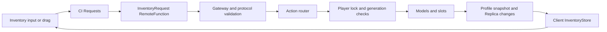

# NorthHills codebase guide

Audit date: 2026-09-15. This describes the supplied source snapshot, not a verified published game. Read [REFACTOR_PLAN.md](REFACTOR_PLAN.md) for defects, priorities, and migration work. No production code was changed during this audit.

## Keybind and gun-removal update

The keybind plan has now been implemented; historical audit counts below describe the earlier snapshot. All in-scope application keybinds use the existing `SharedUtilities/InputActionService` through `ReplicatedFirst/ClientUtilities/InputBindings`. Prompts are explicitly excluded by the user, and keep their existing native handling. Shop, AI, and vendor controls retain their existing boundaries.

Keybind defaults live only in `ReplicatedStorage/SharedAssets/Keybinds.luau`. To add or change a keybind, update its typed action there, create it with `InputBindings.create` in its owning feature, subscribe through `InputBindings.connect`, and destroy it during teardown. Use the binding's state instead of `IsKeyDown`; do not register application shortcuts through UIS, CAS, or CAU. GUI action buttons use `SetUIButton`. UIS remains for pointer/device/focus observation and generic widget mechanics. Focus cancellation and action replacement release accepted inputs and dispose subscriptions. Each action name has one owner; slider instances share one set of actions.

Pointer/trigger activation is outside the keybind catalog. `Inventory/Input/ToolInput` owns one InputActionService action for all equipped tools: mouse left button, gamepad R2, and the current tool's mobile button. Press/release charges and releases melee; pressing toggles flashlight/lantern. Tool controllers expose their mobile button and implement tool behavior without registering input actions. `Results` owns its dismissal action for mouse/touch, R2, and the gamepad confirm button. Its higher-priority context consumes those inputs, and tool activation stays blocked while results are visible.

Hotbar slots use ordered action definitions. `KeybindDisplay` derives their text from the configured physical key, and SlotButton reuses KeybindBadge.

The bundled PlayerModule's `CameraModule/CameraInput` no longer binds `I`/`O` for keyboard zoom, as requested because zoom is script-controlled. Their keyboard state and zoom calculation were removed too. This also frees `I` for the IAS inventory action without an inventory-specific camera dependency. Preserve this change when updating PlayerModule.

Gun code has been removed: Revolver config, client/server gun Template modules, Bullet definition, firearm types/attributes/defaults, and gun aiming/recoil/camera-relative viewmodel branches. Melee tools, flashlight/lantern, thrown projectiles, AI projectiles, general Fastcast support, and grip tracking remain. Non-code Studio gun assets are outside this source-code removal.

See [KeybindPlan.md](KeybindPlan.md) for scope and validation and [Tests/README.md](Tests/README.md) for the regression commands and remaining Studio checks.

## Work-in-progress scope

**Shop and AI are under active development. The user has instructed that neither be touched during refactoring.** Their descriptions are snapshot reference material, not instructions to fix, disable, complete or remove them. This includes shop-related dialogue/catalog/UI and AI-related legacy code, templates and client effects. Preserve their interfaces when changing shared code. R07 and R10 in the refactor plan are deferred until the user explicitly reopens that scope.

## 1. What this project is

NorthHills is a Roblox multiplayer survival game. Players move through a generated environment, collect and equip items, encounter the Phil NPC, interact with doors and containers, and survive a day/night cycle with changing weather. Client code supplies camera motion, character animation, inventory UI, menu/shop presentation, audio, lighting, and haptics. Server code owns profiles, inventory mutations, NPC decisions, combat hit processing, world interactions, and round results.

Some visible features are unfinished. `Systems/Shop.handleRequest` returns nil; dialogue purchase confirmation currently fabricates success without transferring money or items. ThrownBat projectile hit callbacks are empty. Money and Survivals are initialized as session attributes rather than loaded from profiles. Treat these as current limitations, not complete game contracts.

### What the checkout does and does not contain

- `sync/` contains **617 Luau files**. The sourcemap maps all 617 to existing files: 605 ModuleScripts and 12 other script instances.
- [sourcemap.json](sourcemap.json) describes **44,904 DataModel nodes**, including non-code models, UI, sounds, meshes, attachments, settings, and 428 PackageLinks. Its `_azul.placeId` is `82219847644832`.
- This is an **Azul Studio-first export**. [ServerStorage/Azul/Config.luau](sync/ServerStorage/Azul/Config.luau) returns an empty configuration table. Studio remains necessary for asset properties, hierarchy editing, tags, and publication.
- The sourcemap records names, classes, GUIDs, children, and file paths. It does **not** record property/attribute values, script Enabled/Disabled state, RunContext, asset permissions, or the contents of the non-code instances. It is not a complete place file.
- The checkout contains no Rojo project, place file, dependency manifest/lockfile, CI workflow, test runner configuration, or deployment procedure. The only root lint configuration is [selene.toml](selene.toml), containing `std = "roblox"`. No Git metadata was available in this workspace.

Consequently, compiling every file is possible; building and running the game from this checkout alone is not demonstrated. Obtain the corresponding Studio place and confirm the Azul mapping before making structural changes. Do not invent a `rojo build` command for this tree.

## 2. Where to start

Read these in order, following the referenced child modules:

1. [GameHandler.server.luau](sync/ServerScriptService/GameHandler.server.luau): server composition, generation, player admission.
2. [ClientLoader.client.luau](sync/StarterPlayer/StarterPlayerScripts/ClientLoader.client.luau), [Menu.luau](sync/ReplicatedFirst/ClientControllers/Menu.luau), and [CharacterHandler.client.luau](sync/StarterPlayer/StarterCharacterScripts/CharacterHandler.client.luau): client startup and the competing character lifecycle paths.
3. [PlayerData.luau](sync/ServerScriptService/GameHandler/PlayerData.luau) and [DataTemplate.luau](sync/ServerScriptService/GameHandler/DataTemplate.luau): persisted state.
4. [Inventory/Service.luau](sync/ServerScriptService/Systems/Inventory/Service.luau) and [InventoryProtocol.luau](sync/ReplicatedStorage/SharedUtilities/InventoryProtocol.luau): the clearest existing feature boundary.
5. [RoundCycle.luau](sync/ServerScriptService/Systems/RoundCycle.luau) and [AI/Initializer.luau](sync/ServerStorage/ServerAssets/AI/Initializer.luau): world and NPC orchestration.
6. The feature-specific server and client paths in the following map; avoid starting with the vendored PlayerModule or the legacy AI tree.

## 3. Repository and boundary map

Paths in the rest of this guide are relative to `sync/` unless prefixed otherwise. `SI` means `ServerScriptService/Systems/Inventory`; `CI` means `ReplicatedFirst/ClientControllers/Character/Inventory`. These abbreviations identify real directories, not new architectural layers.

| Area                                                         | Responsibility and placement                                                                                                                                                            |
| ------------------------------------------------------------ | --------------------------------------------------------------------------------------------------------------------------------------------------------------------------------------- |
| `ReplicatedFirst/ClientControllers/Menu*`                    | Loading, menu camera, menu buttons, settings and player/character startup.                                                                                                              |
| `ReplicatedFirst/ClientControllers/Player/`                  | Session-level interface, shop/dialogue, haptics, ambience, replicated events, lighting, interactable presentation.                                                                      |
| `ReplicatedFirst/ClientControllers/Character/`               | Respawn-level inventory, locomotion, animation, view model, camera, health/stamina presentation, entity effects.                                                                        |
| `ReplicatedFirst/ClientControllers/Tools/`                   | Local equipped-item animation, input feedback and sounds; paired with server tool controllers.                                                                                          |
| `ReplicatedFirst/ClientData*`, `ClientUtilities/`            | Mutable local coordination and client helpers. `ClientRuntime` tracks startup/controllers; `ClientData` holds movement/camera modifiers and locks.                                      |
| `ReplicatedStorage/Communication/`                           | `Networking`, `InventoryRemotes`, and a separate custom `Packet` implementation with codecs. Remote instances also exist as Studio assets.                                              |
| `ReplicatedStorage/SharedAssets/`                            | Asset hierarchy plus dictionaries: item/material configs, inventory defaults, dialogue, shop categories, projectile definitions, chase profiles, lighting schema, settings definitions. |
| `ReplicatedStorage/SharedUtilities/`                         | Shared contracts and reusable operations: inventory protocol, item/material rules, animation/audio, character replication, interactable motion, input adapters, geometry and bootstrap. |
| `ReplicatedStorage/SharedClasses/`                           | Springs, hitbox implementations, UI helpers, weather and bundled dependencies. Mixed application/vendor ownership.                                                                      |
| `ReplicatedStorage/ExternalLibraries/`                       | Vendored Vide, Replica and UI Labs; shims resolve `.pesde` source trees.                                                                                                                |
| `ServerScriptService/GameHandler*`                           | Composition root, profile adapter/template, settings creation and writes.                                                                                                               |
| `ServerScriptService/Controllers/`                           | Player/character lifecycle; tools; status effects; projectiles; remote event adapters.                                                                                                  |
| `ServerScriptService/Systems/`                               | Long-lived features: inventory, dialogue, shop, round cycle, interactables, props and sound triggers.                                                                                   |
| `ServerScriptService/Foligen*`                               | Startup procedural vegetation generation, configuration, validation, placement and spatial sampling.                                                                                    |
| `ServerStorage/ServerAssets/AI/`                             | Current NPC initializer, behavior/state/action/utilities, targeting, movement and pathfinding.                                                                                          |
| `ServerStorage/ServerAssets/Classes/`                        | Server effects/physics objects: ragdoll, moving prop, spit puddle.                                                                                                                      |
| `ServerStorage/ServerAssets/` elsewhere                      | ScoreTracker, PlayerMemory, dictionaries, entity templates and non-code assets. `AIOld/` is a separate legacy implementation.                                                           |
| `ServerStorage/ItemTemplates` (Studio)                       | Canonical material/item model templates used by current inventory. Not a physical source directory.                                                                                     |
| `ServerStorage/ServerUtilities/`                             | ProfileStore, AutoRig, SoundEvents, AssetPreloader.                                                                                                                                     |
| `StarterPlayer/StarterPlayerScripts/PlayerModule*`           | Bundled Roblox camera/control implementation; preserve upstream provenance.                                                                                                             |
| `StarterPlayer/StarterCharacterScripts/`                     | Character startup and default-animation suppression.                                                                                                                                    |
| `Workspace/Components/Entities/Phil/Initializer.server.luau` | Direct current-Phil startup hook.                                                                                                                                                       |
| `Workspace/Ignore/SoundTriggers/`                            | Crows/Bats config modules embedded in scene assets.                                                                                                                                     |

ServerStorage and ServerScriptService code is not a client data API. ReplicatedStorage code and assets are visible to clients. Keep private profile state in server-only storage and authoritative mutation entry points in server modules; shared pure policy functions can remain in ReplicatedStorage. “Shared” does not guarantee a module is pure: projectile definitions branch on execution side, and `NPCDialogue/Zara` accesses Workspace at require time.

## 4. Execution and lifecycle

### Server startup and player admission

`GameHandler.server` requires its collaborators, constructs Inventory, runs `Foligen.generate`, and initializes settings. It builds `PlayerMemory.mapping` from `SharedAssets.Mapping/<building>/Floor` and `Rooms`; then initializes events, status effects and projectiles. Prop placeholders are replaced before the interactable scan. `Bootstrap.startModules` starts the remaining immediate `Systems` ModuleScripts, sorted by name, excluding manually started Inventory and PropSpawner.

Only then are PlayerAdded/PlayerRemoving connected; an existing-player loop catches players who arrived during generation. On admission:

1. `PlayerData.load` obtains a session, associates the user ID, reconciles the template and registers session-loss handling. Reconciliation currently also restores starter items to saved empty slots; see the persistence warning below.
2. `PlayerSettings.ensureSettings` creates settings ValueObjects.
3. Inventory loads and materializes the saved inventory, then creates owner-only replication.
4. `Controllers/Player.new` initializes session scores/money and hooks character lifecycle.
5. `Controllers/Character` configures the character and starts server character subcontrollers.

Removal destroys the player controller, unloads inventory, then releases the profile. ProfileStore itself has shutdown saving; there is no equivalent retained application-wide system registry to stop all feature loops. A controller can return from `.new` before its deferred `init` has completed. The bootstrap success result is therefore not a readiness guarantee.

Separate scripts include `GroupChecker.server` (group/rank admission policy) and `DoorQteTest.server` (a scene/network test interaction). Their source is present, but Enabled state in the actual place cannot be inferred.

### Client startup and respawn

`StarterPlayer/StarterPlayerScripts/ClientLoader.client` waits for inventory remotes, requests Replica data, constructs Mouse, then Menu. Menu obtains pre-existing PlayerGui screens and uses `MainController` to start Player controllers. It also independently hooks CharacterAdded and starts Character controllers.

`StarterCharacterScripts/CharacterHandler.client` waits for `ClientRuntime.hasLoadedPlayerControllers`, then calls `ClientUtilities/CharacterControllers.loadControllers` for the **same Character folder**. Both use the global active-character-controller list; Menu also retains its own hooks. This is an observed duplicate ownership problem. A fixed-name RenderStep binding can hide one duplicate while its other connections survive. Until this is repaired, test every client feature through death and respawn, not only initial join.

Nested controllers such as Core, Effects and Stats discover child modules. Constructors use a mix of immediate calls, `task.spawn` and `task.defer`. Dependencies that need a Humanoid, Torso, camera, GUI or settings must be ready when the deferred work actually executes. R6 assumptions are explicit in view-model/rigging code (`Torso`, `Right Shoulder`, `Left Shoulder`); R15 compatibility is not established.

### Existing cleanup conventions

Most classes use `new`, `init`/`preload`, `connections`, child-controller maps and `destroy`. Some disconnect and clear tables; others nil fields and remove the metatable. `Bootstrap.destroyModules` suppresses errors, while `ClientUtilities/ModuleLoader` reports them and destroys in reverse order. `cleanUp`, `teardown`, `Stop`, `Destroy` and lowercase `destroy` coexist.

For new application code, make its owning controller explicit, retain every connection/task/child, and make `destroy` safe to call twice. Do not add a second lifecycle framework. The existing Janitor/Signal implementations inside vendor packages belong to those packages until intentionally adopted at an application boundary.

## 5. Inventory: actual end-to-end design

### State, persistence, and representations

The server owns a per-player `PlayerState` under `ServerStorage.InventoryPlayers/<userId>`. Hotbar/Storage slots are ObjectValues pointing to item Models; unequipped models live in StoredTools. Items have stable `ItemId`, `ItemType`, StackCount and allowed persistent attributes. `State/SlotIndex` is a derived lookup, not another independently writable inventory.

**Persistence warning:** ProfileStore recursively fills missing string keys from DataTemplate on every load. InventoryCodec omits empty slots, while DataTemplate uses string slot keys for starter items. An intentionally emptied starter slot is therefore repopulated on the next load. The second audit pass reproduced eight hotbar and two storage additions from an empty saved v2 inventory using the actual reconciliation function and template. Explicit zero material balances remain zero. Fresh-player seeding must be separated from normal profile reconciliation (R03).

`SI/Persistence/InventoryCodec` serializes the model/slot representation into profile records. `Service.commit` rebuilds the index, updates the in-memory profile, then applies replica changes. **Commit is not an immediate DataStore save and does not roll back prior Instance mutations.** ProfileStore owns durable writes and sessions.

`SI/Replication/InventoryReplica` creates the Inventory token and subscribes only the owner, including readiness handling. The client's `CI/InventoryStore` attaches via Replica.OnNew and publishes a Vide source plus a changed event. The vendored Replica supports announcing existing replicas to a new OnNew listener, so requesting data before constructing InventoryStore is not inherently a missed-initial-data bug.

`CI/Selection` adds optimistic selected-slot intent and reconciles with server `equipIntentSequence/currentSlot`, reverting after a wait limit. This is a useful distinction: local selection intent is not authoritative ownership. `CI/View` composes the replica snapshot and selection into HotbarView and InventoryPanel, and owns a separate `isOpen` source and mouse-unlock token.

`CI/Drag` renders drags by lifting the slot's real item visuals (`ItemIcon`, `ItemText`, `Count`, `DurabilityBar`, listed in `Drag/DragLayer/ItemVisuals`) out of the `SlotButton` into a layer frame; nothing is cloned. Dragging is a live rearrangement: after a short dwell on a valid empty or different-type slot, `DragController` sends `move`/`swap` immediately (serialized, latest hovered slot only), so the displaced item always shifts into the slot the dragged item just vacated. Same-type stacks merge only on release; releasing elsewhere returns the item to its current slot or drops it. Because the Vide bindings stay attached, each store change is the visual handoff: the controller calls `DragLayer:relocate()` to exchange the lifted children for the item's new slot, and `finish()`/`cancel()` when the release resolves. Renaming those slot children or moving item rendering out of `SlotButton` breaks drag presentation.

### Request path



`InventoryRemotes.ensureServer` creates the request remote and removes an obsolete replication remote. Service also removes legacy inventory cache/slot representations. Do not rebuild UI against those removed paths.

`InventoryProtocol` owns actions, response codes, payload types and limits. It validates finite numbers, zones, identifiers and action-specific fields. The server gateway limits requests to 30/s per player; pickup has a separate 8/s limit. Router dispatches equip/unequip, move/swap, merge/split, drop, upgrade, capacity use, throw and release. Pickup also enters through the server world-interaction path.

`Service.withPlayerAction` records the player/state/generation for the request; `withLock` rechecks readiness and generation after waiting. The per-player queue caps pending entries at 32. Internal grants deliberately have a distinct entry path; do not invoke a lock-acquiring grant from inside an existing inventory lock.

### Equip, pickup, upgrades, and throw

- `Equipment/EquipTransition` coordinates desired slot, intent sequence and delayed hold/equip stages. `ItemRigging` positions the item, `ControllerHost` creates the server tool behavior, and CurrentSlot updates authoritative equipped state. Client ToolControllerHost creates matching local presentation.
- `World/WorldItems` discovers/adopts tagged world items. `Items/Templates` validates the server template, `ItemFactory` creates or repairs models, `ItemIds` prevents duplicate identities, and `Grants/Allocator` merges stacks and finds space.
- Materials (Nails/DuctTape) are balances keyed by material ID; they are not ordinary slot records. Capacity upgrades consume configured gear; item upgrades consume balances and replace the model while preserving identity and allowed attributes.
- `Throwing/PendingThrows` removes the owned slot item into pending storage, commits consumption, then launches on a client release marker or server fallback. It validates ownership and prevents repeated launch/finalization. A terminal cleanup destroys the original item. Failure recovery/drop policy is not an implemented transactional guarantee.

### Invariants to preserve while extending

Use ItemFactory/placement/Service operations rather than directly editing client state or profile tables. Keep IDs unique and quantities conserved. A material must not become a slot item. Hotbar eligibility currently means a configured controllerClass: Move and client drag enforce it, but allocation, splitting, direct grant, hydration and replacement do not consistently do so. Add a regression across all paths when correcting this rule (R04).

Current protocol bounds include hotbar 10, storage default 12/max 40, capacity step 5, item identifier length 128, remote wait 10 seconds and equip-intent future tolerance 60 seconds. Read the module before changing these; UI dimensions, saved capacities and server validation are separate consumers.

## 6. Profiles, settings and other state owners

| Concept                  | Current owner                                                        | Derived/other representations and caveats                                                                                                                                                                        |
| ------------------------ | -------------------------------------------------------------------- | ---------------------------------------------------------------------------------------------------------------------------------------------------------------------------------------------------------------- |
| Durable player session   | `GameHandler/PlayerData`, vendored ProfileStore                      | Store `PlayerData0`, key UserId string; Studio uses `.Mock`. Session loss clears reference and kicks.                                                                                                            |
| Inventory schema         | `DataTemplate.Inventory`, `InventoryProtocol`, `SI/Persistence`      | Version 2. Hydrator reseeds any unequal version; missing/invalid records can be skipped then overwritten. There is no explicit version migration chain.                                                          |
| New-player loadout       | `SharedAssets/Dictionaries/InventoryConfig` plus DataTemplate        | Storage includes BaseballBat and Backpack; materials start at Nails 50/DuctTape 10. Empty runtime replica state is not a starter loadout.                                                                        |
| Settings definitions     | `SharedAssets/PlayerSettings`                                        | UI type, description, default, image/options. DataTemplate copies the entire definitions table into saved Settings; generated ValueObjects and later writes use scalar values. This mixed shape needs migration. |
| Settings runtime         | `GameHandler/PlayerSettings`                                         | Player Settings category folders and Bool/Number/StringValue instances; remote transfer checks primitive type but not full allowed range/options.                                                                |
| Item behavior/display    | `SharedAssets/Dictionaries/ItemConfigs`, ItemConfigTypes, ItemUtils  | `ItemType` attribute preferred, then legacy `Type`, then Name. ViewModel still calls getItemConfig; getToolConfig has no identified caller. Shop/dialogue instead load ShopCategories independently.             |
| Material metadata        | `MaterialConfigs`, MaterialUtils                                     | Nails/DuctTape also have legacy ItemConfigs; audit callers before removing the latter.                                                                                                                           |
| Round phase/time/climate | Server `Systems/RoundCycle`, CycleConfig, Climate, replicated Values | Remote snapshots and client fallback reads repeat some fields. Some config is cached at require time; some clients read Values live.                                                                             |
| Results and money        | Server ScoreTracker, Player and RoundCycle/Results                   | Session attributes, reset on admission; not persisted by DataTemplate.                                                                                                                                           |
| Room-visit memory        | Server PlayerMemory                                                  | Mapping from Studio assets; Player periodically records room visits. Separate from saved profiles.                                                                                                               |
| NPC state                | Current AI initializer, per-agent behavior/state machine             | cachedBehavior, target registries, paths, speed and animator; ownership defects listed in R07.                                                                                                                   |
| Status effects           | Server Controllers/StatusEffects                                     | Client definitions/presentation and StatusEffectSync are projections; stacking/refresh replication is incomplete.                                                                                                |
| Local motion/UI          | ClientData, ClientRuntime and controller state                       | Movement/FOV/camera locks, aiming and haptics. Stamina is client-owned. `InInventory`, `isInventoryOpen` and View.isOpen disagree.                                                                               |

Settings include video toggles/distortion slider, sprint/crouch Hold/Toggle choices, photosensitivity, music and SFX controls. Do not treat a client control's slider bounds as server validation. Do not treat a locally enforced stamina, movement or camera restriction as a security boundary.

## 7. Other important runtime flows

### AI and player sensing

The scene Phil initializer calls `ServerAssets.AI.Initializer` with behavior Phil. Initializer loads the behavior's Configuration, States, Actions, Utils and Animator, constructs targeting/pathfinding/speed/state machine, starts Wandering, and updates on Heartbeat. Wandering can select a target and switch to Chasing. Stalking exists but a current transition into it was not found. Health utility hooks are empty. Attacker is a separately loaded utility with target controllers.

Targeting discovers possible targets under configured Components folders, caches candidates, and applies perception/raycast rules. Pathfinding has explicit server network ownership for NPC parts. Player room memory and server SoundEvents/noise detection support intended richer AI, but the old AI is not proof that current Phil uses every legacy behavior. Snapshot initialization/target cache observations are recorded in deferred R07; they do not authorize changes to the AI currently in progress.

`ServerAssets/AIOld` has another Phil implementation, another state machine, legacy Pathfinding and NewPathfinding. Entity template initializers under `ServerAssets/Entities/{Phil,PhilOld}` require an absent `ServerAssets.Classes.AI`. These templates may be dormant; inspect Studio clone paths and script state before deleting or redirecting them.

### Combat, physics, and status effects

Server tool controllers validate the sender against the equipped item's owner. Melee derives charge/damage on the server and uses a hitbox against Components.Entities, calling a target's TakeDamage BindableFunction when supplied or its Humanoid. Client Melee animates/sends intent; it is not the damage authority. Delayed swing cleanup is currently unsafe (R06).

Server Projectiles uses Fastcast and shared projectile definitions, broadcasting data for client cosmetics. Spit can create a server SpitPuddle and apply status damage. ThrownBat has an empty hit handler; verify feature intent before promising damage. Client projectile catch-up estimates flight position, and should be checked under latency for acceleration/age effects.

StatusEffects supports stack/refresh/ignore/highest policies and heartbeat ticks. Bleeding, Burning and Corroding share a nonlethal damage pattern; client visuals are separate implementations by design. The server replicates creation/removal but some refresh/stack branches return without publishing changed state.

Character Core handles fall damage, R6 ragdoll, accessory adjustment and door bashing. MovingProp samples velocity/hits to damage players and eventually anchors a stationary prop. These interact with Roblox physics ownership; server-side code reading a client-simulated part's velocity is not automatically trusted physics.

### Rounds, weather and results

Requiring RoundCycle moves the preset Props folder from Workspace into ServerAssets. Construction preloads music/climate, prepares props and starts the loop asynchronously. Day duration follows the selected music/end position; night duration uses configured time and climate multiplier. The countdown subtracts seconds after waits, so it measures loop progress rather than an absolute server deadline.

Phase transitions choose climate, update Values and send snapshots/events to ready players. Climate has a graph of Clear, Dry, Foggy, Rainy, Stormy, Wet and Windy, using history/severity rules. Client CycleEvents coordinates weather, time/lighting, transitions, thunder and UI; Ambience uses scene sound/region assets. End-of-night results update ScoreTracker and attributes for all players, including group membership lookups. Errors in that synchronous result path can interrupt the round.

### World generation and interaction

Foligen (header v3.1) generates vegetation before normal server player setup. Settings define seed, bounds, noise/placement rules, output path and per-type amounts: the checked-in defaults request 22,600 total tree/bush/flower/stump attempts, not a guaranteed count of successful placements. Work is batched with yields. The output instance contents cannot be reviewed from the source alone.

PropSpawner finds `PropSpawn` tagged placeholders, picks prefab variants using nearby usage penalties, places the clone with size/rotation inheritance, then removes the placeholder. A placement failure cleans the failed clone. Interactables then scans `Interactable` tags, resolves Class attributes, finds or creates prompts, and dispatches Doors, Drawer, Locker, ItemPickup or Fusebox controllers. A tagged Folder's children are expanded on the initial scan; new children do not automatically acquire controllers through a folder-child listener.

Shared `InteractableMotion` defines motion attributes and spring modes. Server door/drawer/locker controllers publish targets; `Player/Effects/Interactables` animates client presentation. PivotDoor also has a server fallback. Door locking and action permission checks are not uniform; a prompt callback still needs server state validation.

SoundTriggers loads Crows/Bats from scene folders. Crows performs periodic overlap queries and emits effects; Bats has no meaningful behavior yet. Fusebox delegates by Subclass to TowerLights; cleanup currently omits destroying that child controller.

### Dialogue and shop

Dialogue owns an NPC registry, one active session/queue policy per NPC, per-player familiarity/context data and choice processing. Zara's definition validates initial distance against a Workspace prompt at 15 studs; the client shop also closes itself on distance. Continued server session validity and timeout handling are incomplete. Some impatience/night/transaction helper APIs have no call sites in the current source.

Shop's client UI has Buy/Repair/Sell option modules, an OptionRegistry, MainPageController, Animator and dialogue integration. Shop ItemInfo and server Dialogue/Registry independently flatten Shared ShopCategories; both overwrite duplicate catalog IDs. ShopCategories/Weapons uses WoodenBat, while current inventory uses BaseballBat and has no WoodenBat item config/template. Catalog-to-inventory mapping is not implemented; do not assume those IDs are interchangeable. The server Shop endpoint is a stub and ChoiceProcessor uses a fixed successful purchase result. This is work in progress and excluded from refactoring; transaction recommendations in R10 are deferred reference notes.

### Presentation, input, and shared helpers

Core/Animation loads tracks and manages healthy/injured states. ViewModel coordinates ArmMotion, GripMotion, ItemState and shoulder replication, while Camera composes Position, Tilt, HeadBob and a late ragdoll-camera binding over PlayerModule's camera. Preserve render priorities and base-offset removal when editing these systems.

Haptics owns an active controller, EffectPlayer, waveform/config modules and character feedback. It checks preferred input/menu state and disposes feedback on teardown. Test keyboard, touch and gamepad separately; the presence of PlayerModule touch/VR support does not prove custom inventory/QTE parity.

Volumetrics supports beam/billboard/particle/trail layers with camera signals and fade tasks; LensFlare and weather classes add other render work. Reduced Effects and photosensitivity settings have real presentation consumers; preserve them when changing effects. Measure on representative devices before reducing visual complexity blindly.

AudioUtils handles Sound and AudioPlayer/Wire playback, sound selection/history, emitters and equalizers. ConnectionUtils handles connection tables. BucketUtils supplies region geometry; MathUtils covers motion/math operations. InputActionService is attributed third-party code with child helpers; ContextActionUtility and MobileButton represent other input approaches. All application keybind registration goes through ClientUtilities/InputBindings and the central SharedAssets/Keybinds catalog. Keep feature ownership explicit and do not add alternate key dispatch.

## 8. Naming, organization, and error handling

### Observed conventions and conflicts

- PascalCase filenames name features/classes; lowerCamelCase locals and methods dominate application code. `.server.luau`/`.client.luau` distinguish executable scripts in the export, while ordinary `.luau` is usually a ModuleScript.
- A file and same-named folder represent a module and its Studio children (`Inventory.luau` plus `Inventory/`). A child is often required as `script.Child`; `script.Parent` refers to the Studio hierarchy, which the sourcemap documents. Moving a file may break both source requires and non-code consumers.
- `__index` plus `.new` is common, but exported shapes vary: instances, singleton module tables, static `.init`, pass-through entry points, and module-load side effects. `Controller`, `Service`, `System`, `Utils`, `Helpers`, `Manager`, and `__vars` do not imply uniform contracts.
- Inventory uses `--!strict`, explicit exported types, action/result enums and units such as `delayTimeSeconds`. Much older code is inferred/any-heavy with names such as `hitboxDelayTime` and `cooldownTime`. Third-party code has its own casing.
- Config lives in nearby Config modules, shared dictionaries, per-class `__vars`, Studio attributes and ValueObjects. Some `__vars` mix defaults and mutable state, and shallow cloning does not isolate nested tables.
- `.story.luau` and `.storybook.luau` are UI Labs previews with fixtures; they are not automated correctness tests. “Test” in a scene script's name is also not a test framework.

### Follow these rules for new code

Keep private feature details under the owning feature; put reusable client/server policy next to the shared protocol/config it describes. Use explicit units for time/distance/angle fields and boolean names such as `isEnabled`. Preserve established item IDs and attribute strings through migrations rather than renaming everything for style.

Keep expected failures as domain results (the InventoryProtocol response model is a useful precedent). Catch exceptions at remote, startup, persistence and async callback boundaries where recovery is possible; report component, operation and relevant stable IDs. Do not copy silent `pcall` cleanup as the preferred convention. Required dependencies should fail with a precise diagnostic; optional presentation can warn and disable itself. Do not erase fields so early that a scheduled callback cannot test destruction state safely.

## 9. How to add a feature that fits

| Feature                            | Concrete edit path and required checks                                                                                                                                                                                                                                                                                                                             |
| ---------------------------------- | ------------------------------------------------------------------------------------------------------------------------------------------------------------------------------------------------------------------------------------------------------------------------------------------------------------------------------------------------------------------ |
| Another melee item                 | Add ItemConfigs entry using ItemConfigTypes, a complete Studio `ServerStorage.ItemTemplates` model and required rig/animation assets. Reuse Melee controllerClass. Check Templates validation, grant/pickup, both inventory zones, equip/unequip, charge, hit, drop, save/rejoin and respawn. Leave Shop catalog/UI unchanged under the current scope restriction. |
| New inventory action               | Extend InventoryProtocol action/payload/result validation, `SI/Requests/Router`, a narrow Actions module and `CI/Requests/InventoryRequests`. Mutate through the existing player queue/commit boundary; test stale generation, forbidden ownership, disabled state and failure after preparation. Add UI only after server behavior works.                         |
| New material                       | Define MaterialConfigs metadata and corresponding world template; use MaterialUtils/balance grant route. Update recipes/display consumers. Test pickup conversion and ensure no material descriptor appears in hotbar/storage snapshots.                                                                                                                           |
| Setting                            | Add a SharedAssets/PlayerSettings definition; extend server validation for its actual type/range/options; add the UI control and consumer with a safe default. Existing saved definition-shaped values require the R09 compatibility step.                                                                                                                         |
| Interactable                       | Add a Systems/Interactables child using the actual `new({instance,prompt,promptHolder})` contract; author Class/other attributes, tags and prompt-holder assets in Studio. Validate distance/state/lock on the server, and use InteractableMotion for compatible client motion. Test destruction, streaming/reappearance and rapid activation.                     |
| Status effect                      | Add authoritative server policy under Controllers/StatusEffects and the appropriate shared/client visual definition. Specify stacking, refresh, duration and cleanup. Test refresh without duplicate visuals and removal/reapply during a fade.                                                                                                                    |
| Phil / AI behavior change          | Out of scope while AI is in progress. Preserve current and legacy implementations, templates, client effects and shared interfaces; R07 is reference only.                                                                                                                                                                                                         |
| Session UI versus character effect | Place session UI under ClientControllers/Player and respawn-bound behavior under Character. Resolve R01 before adding another character startup hook. UI primitives belong in Player/Interface/Components with UI Labs stories.                                                                                                                                    |
| Purchase/repair/sale               | Out of scope while Shop is in progress. Preserve Shop and its dialogue/catalog/UI integration; R10 is reference only.                                                                                                                                                                                                                                              |

## 10. Development, verification, and operation

### Practical local workflow

1. Open the matching Studio place and verify Azul's place mapping. Confirm required folders/attributes/tags and access to animations/audio/meshes. Back up the place before hierarchy changes.
2. Use the checked-in sourcemap for editor instance resolution. It does not supply Roblox API definitions. Pin compatible tooling before turning current diagnostics into a CI gate.
3. Run read-only checks from the repository root. Use a **Luau-enabled** StyLua binary and provide cached/pinned Roblox definitions to luau-lsp:

   ```powershell
   selene --display-style Json2 sync
   stylua --check --syntax Luau --allow-hidden --output-format Summary sync
   luau-lsp analyze --platform roblox --sourcemap sourcemap.json --definitions <Roblox-definitions-file> sync
   ```

   Replace the placeholder with a real definition file. These commands are not currently clean gates. The PATH StyLua found during audit lacked Luau support and could misleadingly skip `.luau` during a directory scan; the installed Rokit copy supported Luau. Rokit launcher shims failed on this machine, while direct installed executables worked.

4. Test in Studio with a server and at least two clients: join, ready/menu transition, movement, collect/equip/drop/throw, damage, death/respawn, NPC targeting, round completion and leave/rejoin. Repeat important flows with simulated latency. Studio ProfileStore.Mock does not prove live DataStore durability or session contention.
5. Use a controlled staging place for real persistence/session-loss tests; never change `PlayerData0` or schema behavior casually. Publication, asset/package versioning and rollback are manual/undocumented in this snapshot.

### Audit check results

| Check                                                         | Result and interpretation                                                                                                                                                                                                                         |
| ------------------------------------------------------------- | ------------------------------------------------------------------------------------------------------------------------------------------------------------------------------------------------------------------------------------------------- |
| Sourcemap integrity                                           | 617 mapped source files exist. Property values and published Enabled state unavailable.                                                                                                                                                           |
| Lune 0.10.5 / `@lune/luau.compile`                            | All 617 source files compiled; no syntax failures. Does not execute Roblox services or type-check.                                                                                                                                                |
| Second-pass actual-source probes                              | ProfileStore reconciliation reproduced starter-slot replenishment; Targeting/Registry returned nil for a second agent inside the shared refresh window. Pure reconciliation and mocked empty scene only, not Studio integration.                  |
| Focused actual InventoryProtocol module probe                 | 17 scalar/boundary assertions passed, covering valid/invalid actions, ID length, slot bounds, finite numbers and selected payload rules. No engine Vector3/Instance or remote integration coverage.                                               |
| Selene 0.31.0                                                 | 579 errors, 698 warnings, zero parse errors; 1,277 diagnostics across 100 files. Vendor test globals dominate undefined-variable noise. InventoryStore's type-function `types` builtin is a known false positive, not a missing runtime variable. |
| Luau-enabled StyLua 2.5.2                                     | 154 files differ from default formatting. No formatting was applied.                                                                                                                                                                              |
| luau-lsp 1.69.0 + sourcemap + local cached Roblox definitions | 500 TypeError diagnostics and 82 other diagnostics. Definition/tool compatibility and `@self` require resolution contribute; this count is not 500 proven runtime bugs.                                                                           |
| Studio integration/build/performance                          | Not run: no connected Studio session or complete place artifact available.                                                                                                                                                                        |
| Automated app tests/CI/security package scan                  | No configured harness, CI, manifest or lockfile to execute. Vendor specs and UI stories are present, but no application regression suite was found.                                                                                               |

Audit probes/logs were temporary and are not a checked-in test harness. The refactor plan specifies permanent behavioral coverage to add before changing production logic.

### Operational facts to know

ProfileStore reports OnError with store/key context; most other code uses `warn`, `print`, assertions or silent pcall. There is no application metrics/tracing pipeline, readiness report or release checklist. Group ID `867384979`, minimum admission rank 15, datastore name, generation seed and scene paths are configuration values scattered through code/assets. The source does not establish production secrets, API-service settings, StreamingEnabled, deployment permissions or performance budgets. Verify these in the place and account configuration rather than assuming defaults.

## 11. Dependencies and change boundaries

Vendored path versions are Vide **0.4.0**, Replica **1.0.3**, UI Labs **2.4.2**; NewHitbox packages include Janitor **1.18.3**, Signal **2.0.3**, typed-promise **4.0.6** and evaera/promise **4.0.0**. Those directory labels are evidence of packaged versions, not proof the source is unmodified. ProfileStore has Mad Studio provenance but no repository release pin. Other bundled code includes Fastcast, hitbox libraries, weather, TopbarPlus, PlayerModule and NoobPath-derived pathfinding.

Do not collapse package-internal signals/promises or rewrite PlayerModule for local style consistency. Separate application cleanup from dependency upgrades; establish origin, local diffs, license and version first. `AIOld`, `EntitiesOld`, `Unused`, asset templates, unused exports and Packet are candidates for reachability review, not safe deletions based on their names.

## 12. Final review notes

Final hash verification found all 617 Luau files and selene.toml unchanged. sourcemap.json changed outside the audit edits: its node count fell from 44,905 to 44,904 while all 617 source mappings remained. The process responsible was not identified; the current map was preserved and final counts use that version. Only the two requested Markdown documents were authored by this audit.

A second adversarial pass after both drafts rechecked profile reconciliation, slot serialization/hydration, current AI caches, shop catalog consumers, client lifecycle owners, cleanup and vendor helper behavior. It added the starter-item replenishment warning and catalog ID mismatch, corrected entry/helper paths, and distinguished the write-only AI cacheLookup from the actively broken refresh cache. Packet Static1/2/3 are separately registered value dictionaries; Hitbox.Stop performs default cleanup; Replica.OnNew announces existing replicas. These are not missing implementations to replace indiscriminately. See the plan's review record for evidence and remaining runtime limits.
